[](https://travis-ci.org/meco-group/omg-tools) [](https://coveralls.io/github/meco-group/omg-tools?branch=master)
[](https://www.codacy.com/app/joris-gillis42/omg-tools)

Optimal Motion Generation-tools is a Python software toolbox facilitating the modeling, simulation and embedding of motion planning problems. Its main goal is to collect research topics concerning (spline-based) motion planning into a user-friendly package in order to enlarge its visibility towards the scientific and industrial world.

This toolbox focuses on receding horizon control for single-agent systems as well as on distributed control for multi-agent systems. The approaches implemented in OMG-tools are described in the following publications:
* T. Mercy, W. Van Loock and G. Pipeleers. "Real-time motion planning in the presence of moving obstacles", European Control Conference, 2016. ([pdf](https://lirias.kuleuven.be/bitstream/123456789/538718/1/TimMercy_2016_ECC.pdf))
* R. Van Parys and G. Pipeleers. "Online distributed motion-planning for multi-vehicle systems", European Control Conference, 2016. ([pdf](https://lirias.kuleuven.be/bitstream/123456789/526758/3/RubenVanParys_2016_ECC.pdf))

If these methods help you with your research, please cite us!

## Examples
### Overview
The animations below give an overview of typical problems that OMG-tools can handle.

<table style="border: none; border-collapse: collapse;" border="0" cellspacing="0" cellpadding="0" width="100%" align="center">
<tr>
<td align="center" valign="center" style="background-color:rgba(0, 0, 0, 0);">
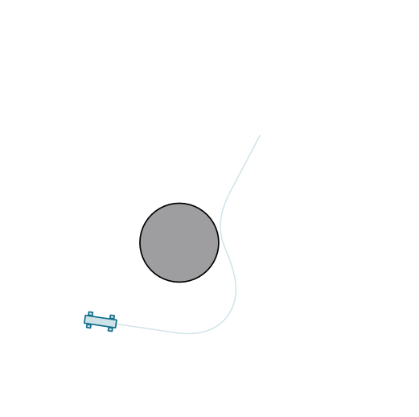
</td>
<td align="center" valign="center" bgcolor="#FFFFFF">
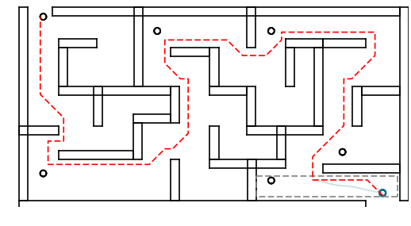
</td>
<td align="center" valign="center" style="background-color:rgba(0, 0, 0, 0);">
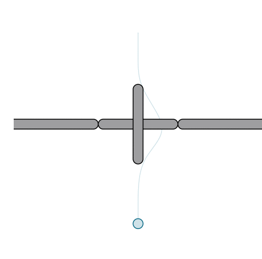
</td>
<tr>
<td align="center" valign="center" style="background-color:rgba(0, 0, 0, 0);">
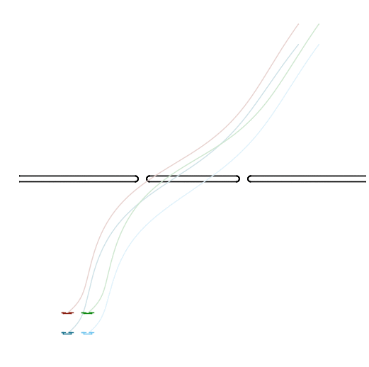
</td>
<td align="center" valign="center" style="background-color:rgba(0, 0, 0, 0);">
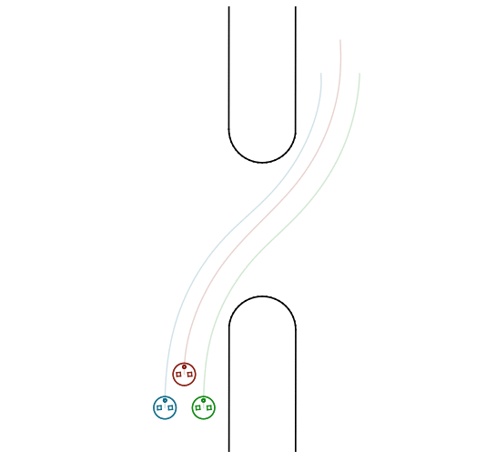
</td>
<td align="center" valign="center" style="background-color:rgba(0, 0, 0, 0);">
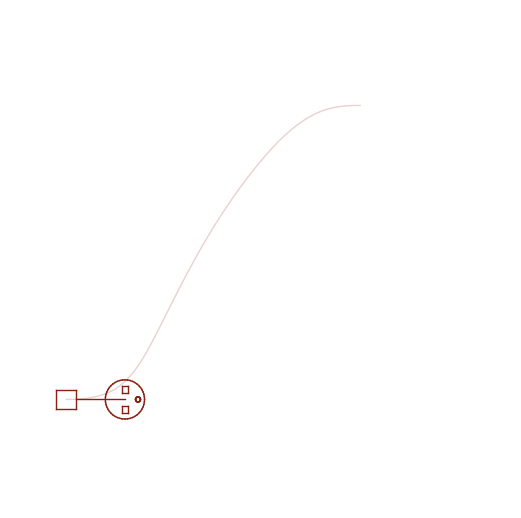
</td>
</tr>
<tr>
<td aliggn="center" valign="center" bgcolor="#FFFFFF">
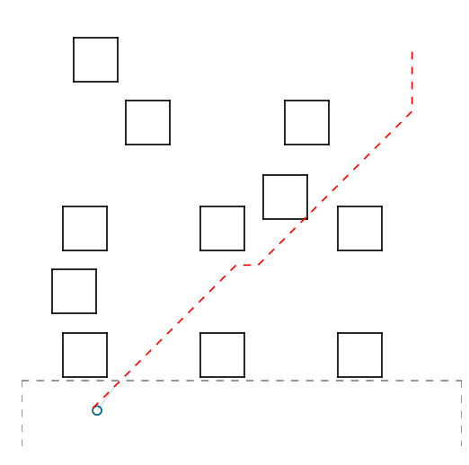
</td>
<td align="center" valign="center" bgcolor="#FFFFFF">
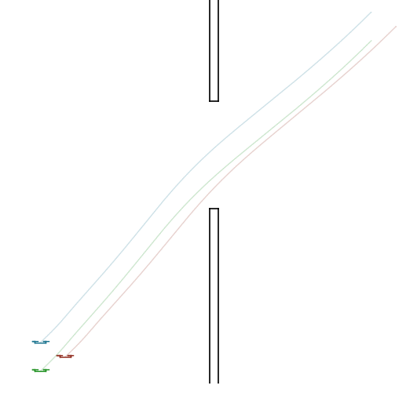
</td>
<td aliggn="center" valign="center" bgcolor="#FFFFFF">
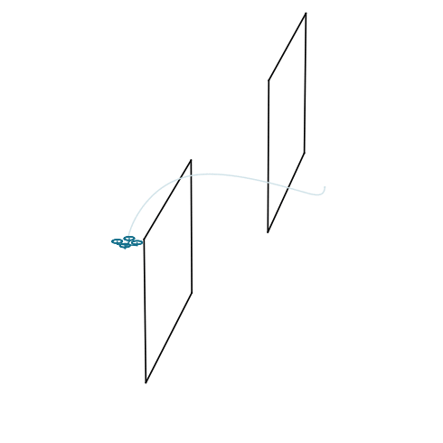
</td>
</tr>
<tr>
<td align="center" valign="center" bgcolor="#FFFFFF">

</td>
<td align="center" valign="center" bgcolor="#FFFFFF">
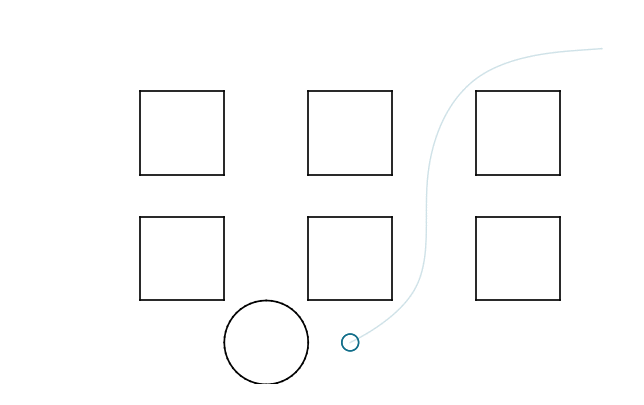
</td>
<td aliggn="center" valign="center" bgcolor="#FFFFFF">
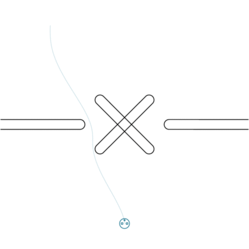
</td>
</tr>
<tr>
<td align="center" valign="center" bgcolor="#FFFFFF">
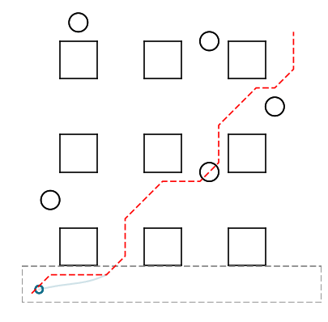
</td>
<td align="center" valign="center" style="background-color:rgba(0, 0, 0, 0);">
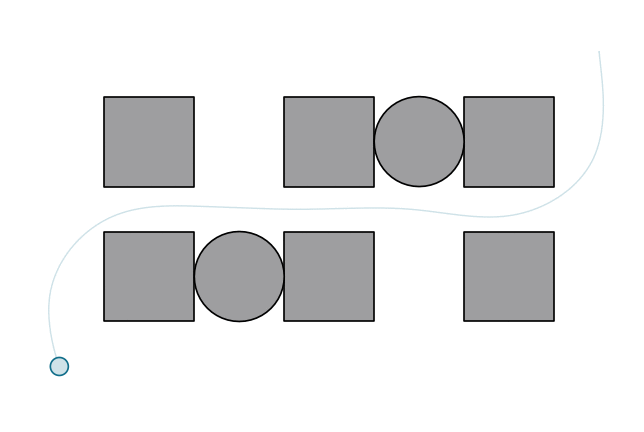
</td>
<td align="center" valign="center" bgcolor="#FFFFFF">
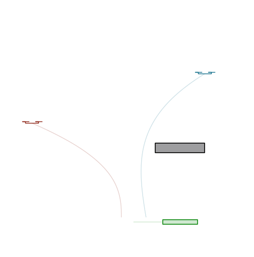
</td>
</tr>
</table>

### Experimental validation
OMG-tools implemented in real life.

<p align="center">
<a href="https://www.youtube.com/watch?v=w7tfz2djHqU">

</a>
</p>
<p align="center">
<a href="https://www.youtube.com/watch?v=J_ShOP_VWTg">

</a>
</p>
<p align="center">
<a href="https://www.youtube.com/watch?v=ozV3aJvEAyY">

</a>
</p>
<p align="center">
<a href="https://www.youtube.com/watch?v=yGGZv57eiB4">

</a>
</p>
<p align="center">
<a href="https://www.youtube.com/watch?v=4JaY0_k24WM">

</a>
</p>
<p align="center">
<a href="https://www.youtube.com/watch?v=8GDlWS1OOOM">

</a>
</p>

### Code example
This elementary code example illustrates the basic functionality of the toolbox for steering a holonomic vehicle from an initial to terminal pose in a dynamic environment.

```python
from omgtools import *

# make and set-up vehicle
vehicle = Holonomic()
vehicle.set_initial_conditions([-1.5, -1.5])
vehicle.set_terminal_conditions([2., 2.])
vehicle.set_options({'safety_distance': 0.1})

# make and set-up environment
environment = Environment(room={'shape': Square(5.)})

# add stationary obstacles to environment
rectangle = Rectangle(width=3., height=0.2)
environment.add_obstacle(Obstacle({'position': [-2.1, -0.5]}, shape=rectangle))
environment.add_obstacle(Obstacle({'position': [ 1.7, -0.5]}, shape=rectangle))

# generate trajectory for moving obstacle
traj = {'velocity': {'time': [3., 4.],
                     'values': [[-0.15, 0.0], [0., 0.15]]}}
# add moving obstacle to environment
environment.add_obstacle(Obstacle({'position': [1.5, 0.5]}, shape=Circle(0.4),
    simulation={'trajectories': traj}))

# give problem settings and create problem
problem = Point2point(vehicle, environment)
problem.init()

# simulate, plot some signals and save a movie
simulator = Simulator(problem)
vehicle.plot('input', labels=['v_x (m/s)', 'v_y (m/s)'])
problem.plot('scene')
simulator.run()
problem.save_movie('scene')
```
<p align="center">
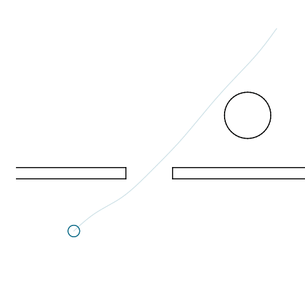
</p>

### More examples
Check out the examples directory for more code examples. There you can find a simple tutorial example which provides a documented overview of the basic functionality of the toolbox.

## Installation
OMG-tools is written in Python 2.7 and depends on the packages numpy, scipy and matplotlib:

`sudo apt-get install python-numpy python-scipy python-matplotlib`

It uses [CasADi](http://casadi.org) as a framework for symbolic computations and interface to IPOPT, a software package for large-scale nonlinear optimization. The current implementation of this toolbox relies on CasADi 3.1, which can be obtained from its [install page](http://install31.casadi.org). In the examples, we use the [HSL linear solvers](https://github.com/casadi/casadi/wiki/Obtaining-HSL), as they result in a much faster execution.

If you want to save your simulation results in Tikz-format, you need [matplotlib2tikz](https://github.com/nschloe/matplotlib2tikz).

If you want to save your simulation results in gif-format, you need [imagemagick](www.imagemagick.org).

To install the toolbox itself, run the following command in the root directory of this repository:

`sudo python setup.py install`

## Authors
OMG-tools is developed by Ruben Van Parys and Tim Mercy as part of their research in spline-based motion planning, under supervision of Goele Pipeleers within the [MECO research team](https://www.mech.kuleuven.be/en/pma/research/meco). Any questions, comments or propositions of collaboration can be addressed to ruben[dot]vanparys[at]kuleuven[dot]be and tim[dot]mercy[at]kuleuven[dot]be.
